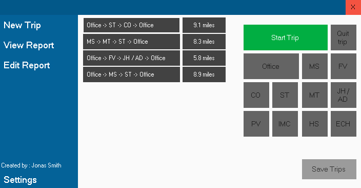
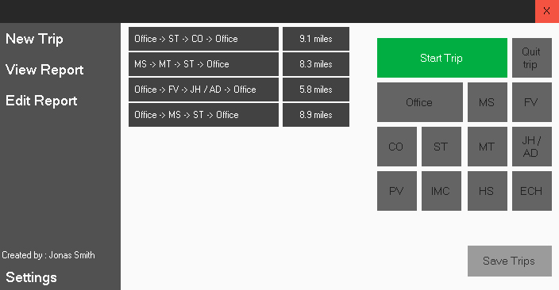
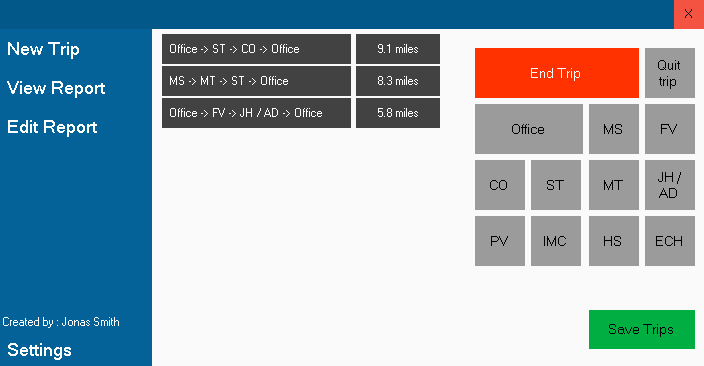
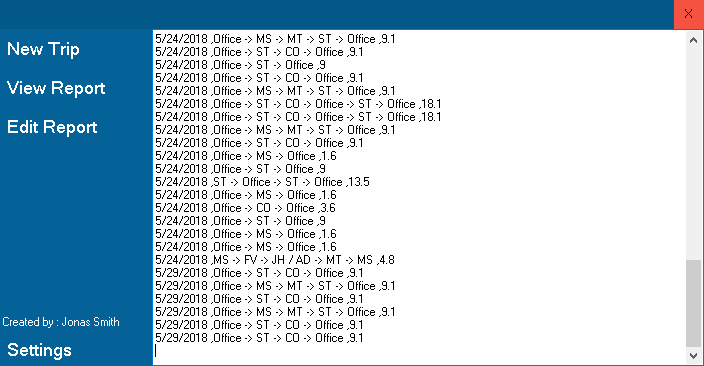

# Mileage-tracker
An application I created to help coworkers at the Carthage R9 School district better track mileage and do less paper work at the end of each month.

# Mileage windows
<h2> Dark/Light Themes </h2>

  

  

<h2> Form while adding new trip </h2>

  

<h2> View trip report </h2>

  

<h2> Edit report window </h2>

 Opens the file location with notepad allowing for the user to edit the mileage data. 

